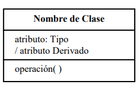
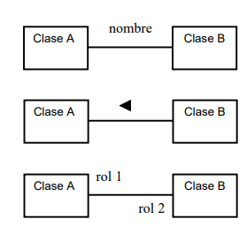
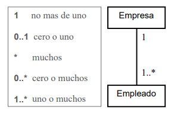

# General info
This is the repository for the course of POO with Platzi, here you will see what I consider to be the most used topics and some examples. This is focuse in the paradigm of Object Oriented Programming but there are several more like, imperative, delcarative, procedure, functional, logic and many more but this one is focuse in objects that sends messages to each other.

## Table of contents
* [General info](#general-info)
* [Technologies](#technologies)
* [Setup](#setup)
* [Summary](#Summary)
> * [Encapsulation](#encapsulation)
> * [Abstraction](#abstraction)
> * [Inheritance](#inheritance)
> * [Polymorphism](#polymorphism)
	
## Technologies
Project is created with:
* VS code
> * Inside VSCode Java Extension Pack

	
## Setup
Install [Vscode](https://code.visualstudio.com/download) in your computer.

Then in the extensions tab search for **Java Extension Pack** and install it.

Start your proyect creating your files with **.java**  

## Summary
Like I mention earlier, there are several programming paradigms but the object programming one is focus, in the creation of classes/objects and been modular, to see more clearly was made the UML (Unified Model Language), next I will talk more about it.
<div></div>
For example here is how a class should look en UML 
In there we can see where it should be the name of the class, the atributes, and operations or methods
<div></div>
Then we have associations which means how are they related is one contains another or used another class etc.

<div></div>
Another important thing is the multiplicity on how are they are related by one to many, many to many etc.

<div></div>
Now talking about actual programming there are some important points, the four most important things in Object Oriented Programming are this ones:
1. Encapsulation
2. Abstraction
3. Inheritance
4. Polymorphism

### Examples

#### Encapsulation
> when in your code, you repeat more than 3 times you should encapsulate it by making it more modular.
 you can acomplish this by creating functions or classes.

> Here is an example: in Java 1.8

```java
public class Shape {

    private String name,color;
    
    public Shape(String name,String color){
        this.name = name;
        this.color = color;
    }

    public Shape(){}

    public void data(){
        System.out.println("Kind of Shape: "+name+" Color: "+color);
    }
    
}
```

#### Abstraction
> The abstraction is when you have multiple class and you can abtract some properties they have in common to make it more easy 

> Here is an example: in java 1.8

```java
class Car {
    private Integer id;
    private String license;
    private Account driver;
    private Integer passanger;
    
    public Car(String license, Account driver){
        this.license = license;
        this.driver = driver;
    }
    void printDataCar(){
        if(passanger != null)
            System.out.println("License: " + license + " Driver: " + driver.name + " Passangers: " + passanger);

    }
}
```
```java
class UberX extends Car{
    String brand;
    String model;

    public UberX(String license,Account driver, String brand, String model){
        super(license,driver);
        this.brand = brand;
        this.model = model;
        
    }
}
```
#### Inheritance
> This is similar to [Abstraccion](#abstraction), but the focus here is to give all properties and methods tho the childrens classes.
 you can acomplish this by creating functions or classes.

> Here is an example: in Java 1.8

```java
class Car {
    Integer id;
    String license;
    Account driver;
    Integer passanger;
    
    public Car(String license, Account driver){
        this.license = license;
        this.driver = driver;
    }

    void printDataCar(){
        System.out.println("License: " + license + " Driver: " + driver);
    }
}
```
```java
class UberX extends Car{
    String brand;
    String model;

    public UberX(String license,Account driver, String brand, String model){
        super(license,driver);
        this.brand = brand;
        this.model = model;
        
    }
}
```
#### Polymorphism
> With this propertie of **polymorphism** you can modify the methods to make it suit for that class.

> Here is an example: in Java 1.8

```java
class Car {
    private Integer id;
    private String license;
    private Account driver;
    private Integer passanger;
    
    public Car(String license, Account driver){
        this.license = license;
        this.driver = driver;
    }
    void printDataCar(){
        if(passanger != null)
            System.out.println("License: " + license + " Driver: " + driver.name + " Passangers: " + passanger);

    }

    public Integer getPassanger(){
        return passanger;
    }

    public void setPassanger(Integer passanger){
        if(passanger == 4)
            this.passanger = passanger;
        else
            System.out.println("Necesitas asignar 4 pasageros");
    }
}
```
```java
import java.util.ArrayList;
import java.util.Map;

class UberVan extends Car{
    
    private Integer passanger;
    Map<String, Map<String,Integer>> typeCarAccepted;
    ArrayList<String> seatsMaterial;

    public UberVan(String license,Account driver){
        super(license,driver);
    }
    @Override
    public void setPassanger(Integer passanger){
        if(passanger == 6)
            this.passanger = passanger;
        else
            System.out.println("Necesitas asignar 6 pasageros");
    }
}
```
